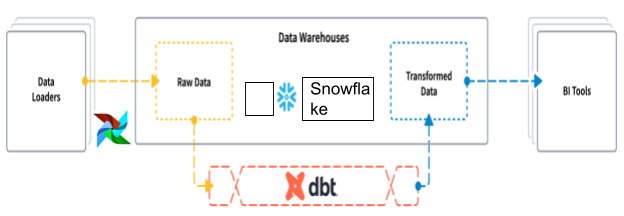

#Scalable DataWarehouse

<!-- Table of contents -->
- [About](#about)
- [Objectives](#objectives)
- [Data](#data)
- [Repository overview](#repository-overview)
- [Requirements](#requirements)
- [Contrbutors](#contrbutors)
- [Contributing](#contributing)
- [License](#license)

## About
<!-- import an image -->

An ELT pipeline that can be used to process data from a variety of sources. The pipeline is designed to be scalable and easy to use. The pipeline is designed to be used in a variety of environments like Data Warehouse. It can be used by analytic engineers in the different department setup transformation workflows on a need basis. 

## Objectives
After joining an AI startup that deploys sensors to businesses, collects data from all activities
in a business - people’s interaction, traffic flows, smart appliances installed in a company, the
objective is to help organisations obtain critical intelligence based on public and private data
they collect and organise.

## Data
The [Data](https://www.kaggle.com/c/rossmann-store-sales/data) used for this project is from open source dataset called PNeuma which is an open large-scale dataset of naturalistic trajectories of half a million vehicles that have been collected by a one-of-a-kind experiment by a swarm of drones in the congested downtown area of Athens, Greece. 

## Repository overview
 Structure of the repository:
 
        ├── airflow  (airflow scripts containing the dags)
        ├── .github  (github workflows for CI/CD, CML)
        ├── screenshots  (Important screenshots)
        ├── scalable_dwh  (dbt configrations and models)
        ├── data    (contains data)
        ├── scripts (contains the main script)	
        │   ├── logger.py (logger for the project)
        │   ├── plot.py (handles plots)
        │   ├── load_data.py (Data loading)
        ├── notebooks	
        │   ├── EDA.ipynb (overview of the Data)
        ├── tests 
        │   ├── test_scripts.py (test for the script)
        ├── README.md (contains the project description)
        ├── requirements.txt (contains the required packages)
        |── LICENSE (license of the project)
        ├── setup.py (contains the setup of the project)
        └── .dvc (contains the dvc configuration)

## Requirements
The project requires the following:
python3
Pip3
docker
docker-compose

## Contrbutors
- Yididiya Samuel

## Contributing
Pull requests are welcome. For major changes, please open an issue first to discuss what you would like to change.

Please make sure to update tests as appropriate.

## License
[MIT](https://choosealicense.com/licenses/mit/)
